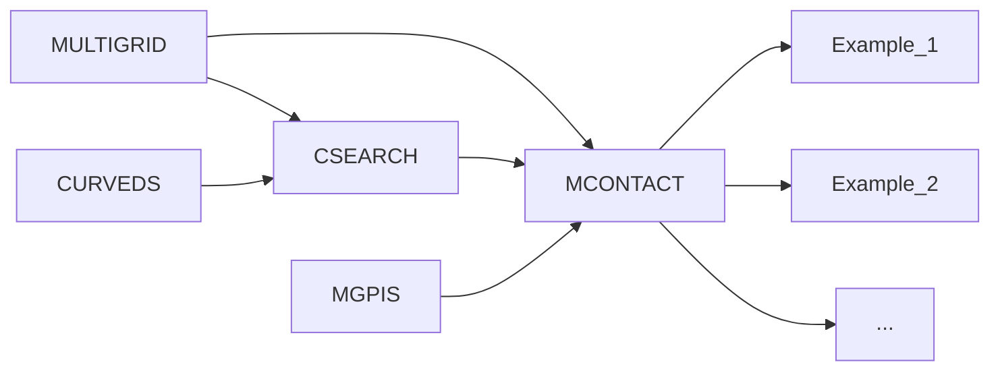

# DDPCA-ADMM

Domain decomposition-based parallel contact analysis by alternating direction method of multipliers.

1.Platform: Linux or Cygwin on Windows (only one of them is needed)
> + Ubuntu link: <https://ubuntu.com/download>
> + Cygwin link: <https://www.cygwin.com/>

2.Prerequisite package: make, g++

3.Prerequisite library: Eigen, Spectra are already contained in the source code
> + Eigen link: <https://gitlab.com/libeigen/eigen/>
>   + or: <https://eigen.tuxfamily.org/index.php?title=Main_Page>
> + Spectra link: <https://spectralib.org/>

4.Compiling command: $ make -j
> + Beforehand, use the "cd" command to switch to the directory where the source code is located..

5.Execution: $ ./Test
> + The minimum required RAM is 128GB.

6.Postprocess:
> + Run the .m scripts in "Postprocess.m" by MATLAB.

In case of any problem in code compilation or execution, please feel free to contact us by email (QuanchengPeng@sylu.edu.cn) or other available communications.

## Logic structure

| Class     | Description |
| --------- | ----------- |
| MULTIGRID | Mesh, interpolation operator of geometric multigrid, stiffness matrix        |
| CSEARCH   | Global and local contact search, adaptive mesh refinement around contact region        |
| MGPIS     | Multigrid preconditioned iterative solver        |
| MCONTACT  | DDPCA-ADMM, dual mortar method        |
